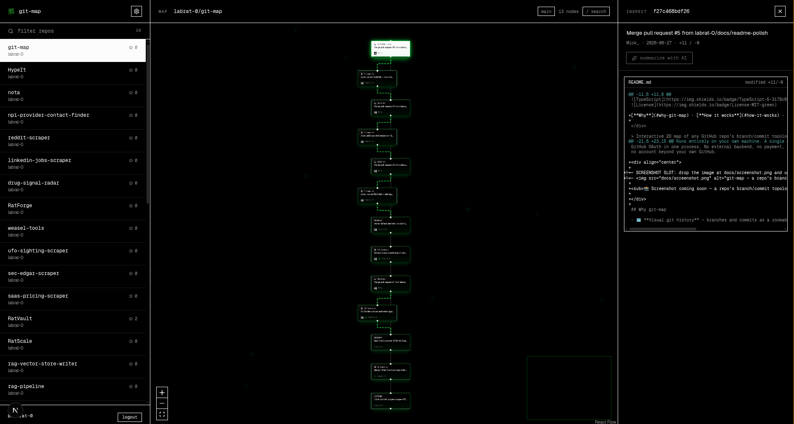

<div align="center">


# git-map

**See any GitHub repo as a map, not a wall of text.**


[**Why**](#why-git-map) · [**How it works**](#how-it-works) · [**Quickstart**](#run-it-locally) · [**Troubleshooting**](#troubleshooting-sign-in)

</div>

> Interactive 2D map of any GitHub repo's branch/commit topology — sign in with
> GitHub, pick a repo, explore the structure visually, and get optional AI
> summaries of individual commits.

Runs entirely on your own machine. A single Next.js app — UI + API routes +
GitHub OAuth in one process. No external backend, no payment, no telemetry,
no account beyond your own GitHub.

<div align="center">

<!-- SCREENSHOT SLOT: drop the image at docs/screenshot.png and uncomment the line below -->
<!--  -->

<sub>📸 Screenshot coming soon — a repo's branch/commit topology, rendered as an explorable canvas.</sub>

</div>

## Why git-map

- 🗺️ **Visual git history** — branches and commits as a zoomable 2D graph, not `git log`.
- 🔭 **Stays readable on big repos** — linear commit runs collapse into expandable nodes.
- 🤖 **Optional AI commit summaries** — 3-bullet plain-English explanation per commit, bring your own key.
- 🔒 **Private by design** — your GitHub token stays server-side; your AI key stays in your browser.
- 💻 **100% local** — clone, add creds, `npm run dev`. Nothing phones home.

## What it is

Sign in with GitHub → your **public** repos list in the sidebar → pick one →
a top-down, zoomable 2D map of its branches and commits (linear runs collapse
into expandable nodes so big repos stay readable). Click a node for the raw
commit diff and an **optional**, BYOK AI-generated 3-bullet summary.

## How it works

```
Browser (Next.js / React Flow)
   |  httpOnly session cookie (GitHub token never exposed to client JS)
   v
Next.js API routes (same app)
   |- /api/auth/login                 -> redirect to GitHub OAuth (CSRF state)
   |- /api/auth/callback              -> exchange code->token, set session
   |- /api/repos                      -> list your PUBLIC repos (Octokit)
   |- /api/graph/[owner]/[repo]       -> GraphQL history -> collapse -> dagre layout
   |- /api/diff/[owner]/[repo]/[sha]  -> commit diff (lazy, on node click)
   v
GitHub API
```

**AI summaries bypass the server entirely.** "Summarize" calls your chosen
provider (OpenRouter or any compatible endpoint) **directly from the browser**
with your own key. The key lives only in browser `localStorage` — it never
touches the server, is never logged. Public repos only; no private code passes
through.

## Run it locally

Needs Node 22+ and a (free) GitHub OAuth App you create — that's what lets the
app sign you in.

### 1. Create a GitHub OAuth App

GitHub → **Settings → Developer settings → OAuth Apps → New OAuth App**:

| Field | Value |
|-------|-------|
| Application name | anything (e.g. `git-map local`) |
| Homepage URL | `http://localhost:4200` |
| Authorization callback URL | `http://localhost:4200/api/auth/callback` |

Register it, then **Generate a new client secret**. Keep the **Client ID** and
**Client secret** handy.

### 2. Configure env

```bash
git clone https://github.com/labrat-0/git-map
cd git-map
npm install
cp .env.example .env.local
```

Fill `.env.local`:

```bash
GITHUB_CLIENT_ID=<your client id>
GITHUB_CLIENT_SECRET=<your client secret>
SESSION_SECRET=<run: openssl rand -hex 32>
OAUTH_CALLBACK_URL=http://localhost:4200/api/auth/callback
```

### 3. Run

```bash
npm run dev      # http://localhost:4200
```

Open it, click **Sign in with GitHub**, pick a repo.

```bash
npm run build && npm start   # production build
npm run lint
npm test
```

> Running on a different port? Update both `OAUTH_CALLBACK_URL` and the OAuth
> App's callback URL to match — GitHub requires them to be identical.

## Troubleshooting sign-in

| Symptom | Cause | Fix |
|---------|-------|-----|
| **404 on the GitHub authorize page** after clicking *Connect to GitHub* | `GITHUB_CLIENT_ID` is wrong, or the OAuth App was deleted | Confirm the app exists at GitHub → Developer settings → OAuth Apps; copy its **Client ID** into `.env.local` |
| **Bounced back to the login screen** (URL shows `?error=oauth_token`) | `GITHUB_CLIENT_SECRET` is wrong — GitHub returns `incorrect_client_credentials` | **Generate a new client secret**, copy it whole (no quotes/spaces/newline) into `.env.local` |
| **`?error=oauth_state`** | Stale/lost session during the round-trip | Make sure `SESSION_SECRET` is set (≥32 chars) and retry |
| Changed any env value | Next.js loads env at boot | Restart the dev server |

> The OAuth App's **Authorization callback URL** must exactly equal
> `OAUTH_CALLBACK_URL` (default `http://localhost:4200/api/auth/callback`).

## AI summaries (optional, bring your own key)

In the app's settings, paste an OpenRouter (or compatible) API key and pick a
model. The key is stored in your browser only and used for direct browser →
provider calls. No key, no AI — everything else works without it.

## Tech stack

- Next.js 16 (App Router) + React 19 + TypeScript
- Tailwind CSS v4 + lucide-react + sonner
- [`@xyflow/react`](https://reactflow.dev) (React Flow) — the canvas
- `@dagrejs/dagre` — automated tree layout
- `@octokit/rest` + Octokit GraphQL — GitHub API
- `iron-session` — signed httpOnly session cookie
- `zod` — schema validation

## Security notes (do not regress)

- GitHub `client_secret` + access token: **server-side only**, never shipped to
  the browser; token stored in a signed httpOnly cookie.
- OAuth `state` parameter guards the callback against CSRF.
- LLM key: **browser-only**, never sent to the server, never logged.
- Public repos only — no private code or diffs pass through the server.
- `.env.local` is gitignored. Never commit your client secret.

## License

[MIT](./LICENSE) — use it, fork it, ship it.
